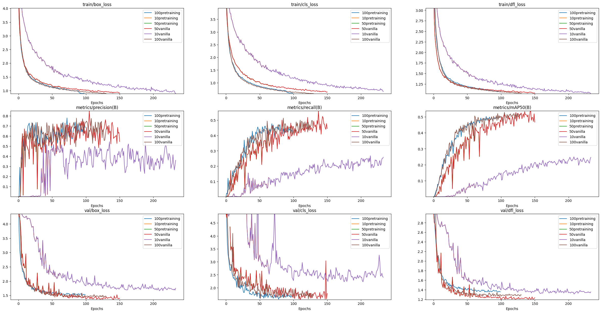
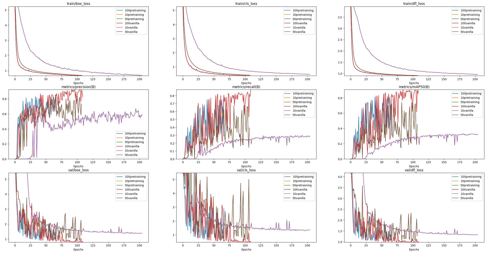

## 2023_processing_and_generating_images_course

Студенты:
Иванов Пётр Алексеевич
Чернов Андрей Владимирович 

- [x] homework_1
- [x] homework_2
- [x] homework_3

**Выбранная задача**: Детекция условных графических элементов на однолинейных электрических схемах. 41 класс.  
**Датасет**: свой. 351 размеченная схема.

**Мы использовали один ноутбук для отрисовки и сравнения результатов, но эксперименты отличаются:**
1. Разные датасеты (точнее, один датасет, подготовленный по-разному)
2. В одном эксперименте (Иванов Пётр) тренировался только backbone, во втором (Чернов Андрей) тренировался также neck (в YOLOv8 используется SPPF, поэтому размерностями мы не ограничены, решили попробовать и neck)

### Экспенимент 1: тренируем только backbone (Иванов Пётр)

### Эксперимент 2: тренируем и backbone, и neck (Чернов Андрей)

### Выводы

Особенность задачи и данных, состоящая в следующем:

1. Это задача детекции
2. Данные очень необычны: объекты мелкие, их много
3. Данных не слишком много, всего 1300 изображений на ~40 классов 

делает подобное предообучение не совсем полезным, как это видно из графиков. Я немного поискал другие техники SSL-предобучения, которые бы лучше подошли для имеющейся задачи, но ничего особо дельного не нашел.

Однако, мы предполагаем, что одна из нижеописанных идей может сработать:

1. Порешать задачу классификации без детекции (вырезать объекты и поклассифицировать их, тут можно взять модель даже с шеей т.к. в YOLOv8 используется SPPF, которая карту признаков любого размера преобразует в вектор фиксированной размерности)
2. Порезать картинки на сегменты поменьше и поклассифицировать пары по немного другому признаку: порешать задачу бинарной классификации на предмет принадлежности сегментов одному изображению или их соседства
