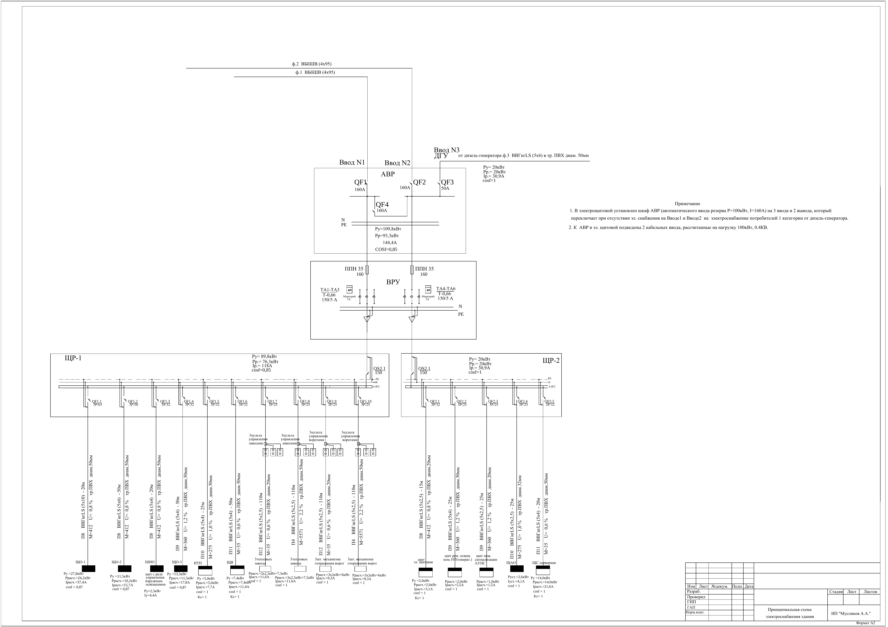
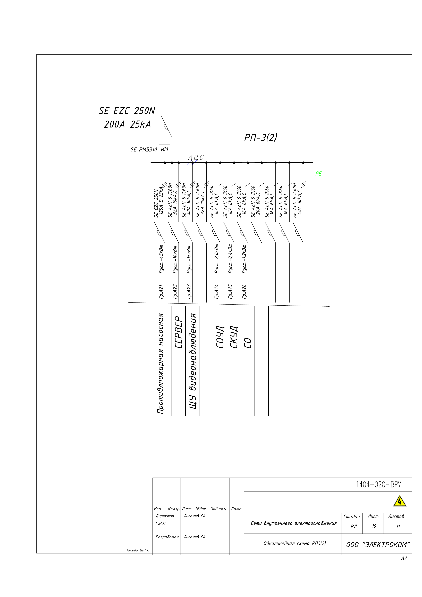

## 2023_processing_and_generating_images_course

Студенты:
Иванов Пётр Алексеевич  
Чернов Андрей Владимирович 

- [x] homework_1
- [ ] ?homework_2

Выбранная задача: Детекция условных графических элементов на однолинейных электрических схемах.   
Датасет: свой. 351 размеченная схема.
|                                          |                                          |
| ---------------------------------------- | ---------------------------------------- |
|  |  |

