## 2023_processing_and_generating_images_course

Студенты:
Иванов Пётр Алексеевич
Чернов Андрей Владимирович 

- [x] homework_1
- [ ] ?homework_2

Выбранная задача: Детекция условных графических элементов на однолинейных электрических схемах. 41 класс.  
Датасет: свой. 351 размеченная схема.


### Иванов Пётр

```python
from google.colab import drive

drive.mount('/content/drive', force_remount=True)

!cp "/content/drive/MyDrive/ML System Design/scheme_sliced_dataset_V4.zip" /content/datasets
!unzip -q scheme_sliced_dataset_V4.zip -d /content/datasets

!pip install -q ultralytics


from ultralytics import YOLO

model = YOLO('yolov8m.yaml')

# fully default hyps
model.train(data='/content/datasets/scheme_sliced_dataset_V4/dataset.yaml', epochs=500, patience=25, batch=32, device='cuda')
```

<details>
    <summary>Output...</summary>

```python  

YOLOv8m summary: 295 layers, 25878901 parameters, 25878885 gradients, 79.2 GFLOPs

train: Scanning /content/datasets/scheme_sliced_dataset_V4/train/labels... 1264 images, 88 backgrounds, 0 corrupt: 100%|██████████| 1264/1264 [00:00<00:00, 1797.95it/s]
train: New cache created: /content/datasets/scheme_sliced_dataset_V4/train/labels.cache
albumentations: Blur(p=0.01, blur_limit=(3, 7)), MedianBlur(p=0.01, blur_limit=(3, 7)), ToGray(p=0.01), CLAHE(p=0.01, clip_limit=(1, 4.0), tile_grid_size=(8, 8))
val: Scanning /content/datasets/scheme_sliced_dataset_V4/val/labels... 228 images, 83 backgrounds, 0 corrupt: 100%|██████████| 228/228 [00:00<00:00, 1035.88it/s]val: New cache created: /content/datasets/scheme_sliced_dataset_V4/val/labels.cache

optimizer: 'optimizer=auto' found, ignoring 'lr0=0.01' and 'momentum=0.937' and determining best 'optimizer', 'lr0' and 'momentum' automatically... 
optimizer: AdamW(lr=0.000233, momentum=0.9) with parameter groups 77 weight(decay=0.0), 84 weight(decay=0.0005), 83 bias(decay=0.0)
Image sizes 640 train, 640 val
Starting training for 500 epochs...

        Epoch    GPU_mem   box_loss   cls_loss   dfl_loss  Instances       Size
        1/500        14G      5.001      5.548      4.126        217        640: 100%|██████████| 40/40 [00:50<00:00,  1.25s/it]
                  Class     Images  Instances      Box(P          R      mAP50  mAP50-95): 100%|██████████| 4/4 [00:05<00:00,  1.32s/it]                   
                  all        228       2522          0          0          0          0

        Epoch    GPU_mem   box_loss   cls_loss   dfl_loss  Instances       Size
        4/500      13.3G      2.949      3.035      2.699        152        640: 100%|██████████| 40/40 [00:44<00:00,  1.10s/it]
                  Class     Images  Instances      Box(P          R      mAP50  mAP50-95): 100%|██████████| 4/4 [00:06<00:00,  1.59s/it]                   
                  all        228       2522    0.00958     0.0387     0.0141    0.00457

        Epoch    GPU_mem   box_loss   cls_loss   dfl_loss  Instances       Size
        5/500      14.3G        2.6      2.625      2.439        383        640: 100%|██████████| 40/40 [00:44<00:00,  1.10s/it]
                  Class     Images  Instances      Box(P          R      mAP50  mAP50-95): 100%|██████████| 4/4 [00:05<00:00,  1.41s/it]                   
                  all        228       2522      0.388     0.0524     0.0312     0.0125

        Epoch    GPU_mem   box_loss   cls_loss   dfl_loss  Instances       Size
      25/500      13.5G      1.337      1.132      1.328        318        640: 100%|██████████| 40/40 [00:44<00:00,  1.11s/it]
                  Class     Images  Instances      Box(P          R      mAP50  mAP50-95): 100%|██████████| 4/4 [00:06<00:00,  1.52s/it]                   
                  all        228       2522       0.71      0.291      0.338      0.201

        Epoch    GPU_mem   box_loss   cls_loss   dfl_loss  Instances       Size
      72/500      14.1G      1.023     0.7132      1.109        293        640: 100%|██████████| 40/40 [00:44<00:00,  1.10s/it]
                  Class     Images  Instances      Box(P          R      mAP50  mAP50-95): 100%|██████████| 4/4 [00:05<00:00,  1.27s/it]                   
                  all        228       2522      0.682      0.419      0.482      0.305

        Epoch    GPU_mem   box_loss   cls_loss   dfl_loss  Instances       Size
      74/500      13.8G      1.026     0.7065      1.113        172        640: 100%|██████████| 40/40 [00:43<00:00,  1.09s/it]
                  Class     Images  Instances      Box(P          R      mAP50  mAP50-95): 100%|██████████| 4/4 [00:05<00:00,  1.26s/it]                   
                  all        228       2522      0.711      0.425      0.491      0.311

        Epoch    GPU_mem   box_loss   cls_loss   dfl_loss  Instances       Size
      118/500        14G      0.932     0.6028       1.05        200        640: 100%|██████████| 40/40 [00:43<00:00,  1.08s/it]
                  Class     Images  Instances      Box(P          R      mAP50  mAP50-95): 100%|██████████| 4/4 [00:06<00:00,  1.56s/it]                   
                  all        228       2522      0.605       0.49      0.512      0.323

        Epoch    GPU_mem   box_loss   cls_loss   dfl_loss  Instances       Size
      131/500      14.1G     0.8888     0.5645      1.033        280        640: 100%|██████████| 40/40 [00:46<00:00,  1.17s/it]
                  Class     Images  Instances      Box(P          R      mAP50  mAP50-95): 100%|██████████| 4/4 [00:04<00:00,  1.11s/it]                   
                  all        228       2522      0.671      0.453      0.513      0.331
    Stopping training early as no improvement observed in last 25 epochs. Best results observed at epoch 106, best model saved as best.pt.

    131 epochs completed in 1.893 hours.

                    Class     Images  Instances      Box(P          R      mAP50  mAP50-95): 100%|██████████| 4/4 [00:12<00:00,  3.12s/it]
                      all        228       2522      0.657      0.461      0.529      0.344
              WD CB 3-pole        228        196      0.851      0.724      0.829      0.585
                  CB 1pole        228        187      0.777      0.614      0.679      0.342
                  CB 3pole        228        113      0.474      0.425      0.504       0.34
           direct  counter        228        109      0.909      0.822      0.914       0.67
           MD WD CB 3-pole        228         52          1      0.518      0.698      0.466
         fuse disconnector        228         74          0          0     0.0883      0.026
       current transformer        228         64      0.546      0.656      0.578      0.243
           reactive device        228          1      0.934          1      0.995      0.895
                  CB 4pole        228         10      0.749        0.7        0.7      0.451
          motorized switch        228         12          1          0          0          0
                 RCD 2pole        228         32      0.774      0.643      0.771      0.543
      current (inductance)        228        204      0.834       0.79       0.87      0.412
        three-phase switch        228         37      0.343      0.486      0.423      0.275
                    switch        228         99      0.522      0.374      0.341      0.138
                       SPD        228         20      0.545        0.3       0.32       0.12
                      fuse        228         19      0.899      0.632      0.792      0.359
              MD CB 3-pole        228          5          1          0      0.522      0.322
               transformer        228         18      0.882      0.832      0.919       0.61
                      lamp        228         21      0.713      0.667      0.782      0.532
                  CB 2pole        228          1          1          0          0          0
                         v        228        512      0.575      0.101      0.296      0.183
                         h        228        608      0.363      0.564      0.303      0.172
                    button        228          2      0.711          1      0.995      0.696
                 RCD 4pole        228          3      0.305      0.333      0.519      0.421
                RCCB 2pole        228         15      0.872      0.867      0.971      0.847
                       ATS        228         18      0.451      0.278      0.262       0.15
                 RCCB 1p+n        228         16          0          0     0.0698     0.0255
                      void        228         59      0.299     0.0943      0.172     0.0752
           contactor 3pole        228          5      0.388        0.4      0.458      0.372
           contactor 1pole        228         10          1          0     0.0907     0.0424
    Speed: 0.3ms preprocess, 12.1ms inference, 0.0ms loss, 6.0ms postprocess per image
    fitness: 0.3622888628731198
    keys: ['metrics/precision(B)', 'metrics/recall(B)', 'metrics/mAP50(B)', 'metrics/mAP50-95(B)']
    results_dict: {'metrics/precision(B)': 0.6571965649393268, 'metrics/recall(B)': 0.46065633835353587, 'metrics/mAP50(B)': 0.5287278835576187, 'metrics/mAP50-95(B)': 0.3437956383526199, 'fitness': 0.3622888628731198}
    speed: {'preprocess': 0.29272886744716714, 'inference': 12.105291349846022, 'loss': 0.00035762786865234375, 'postprocess': 6.027209131341231}
```
</details>  

| labels                              | pred                              |
| ----------------------------------- | --------------------------------- |
| 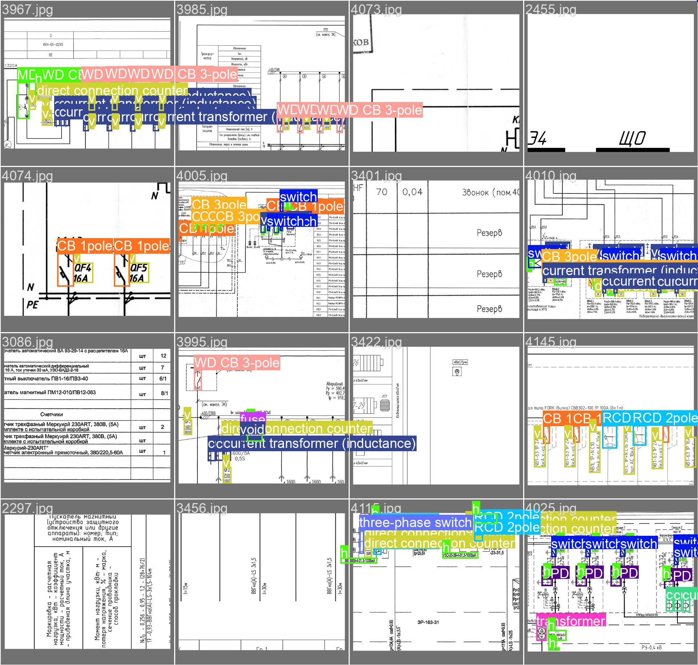 | 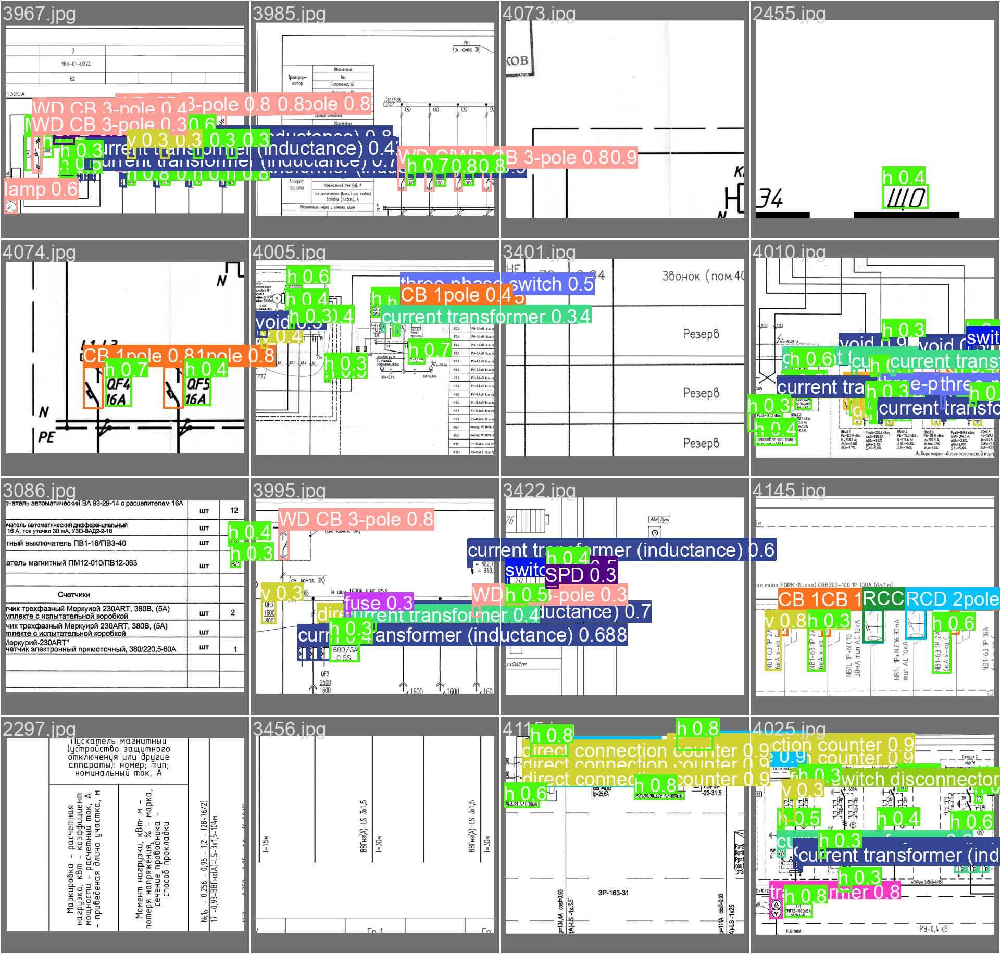 |
| 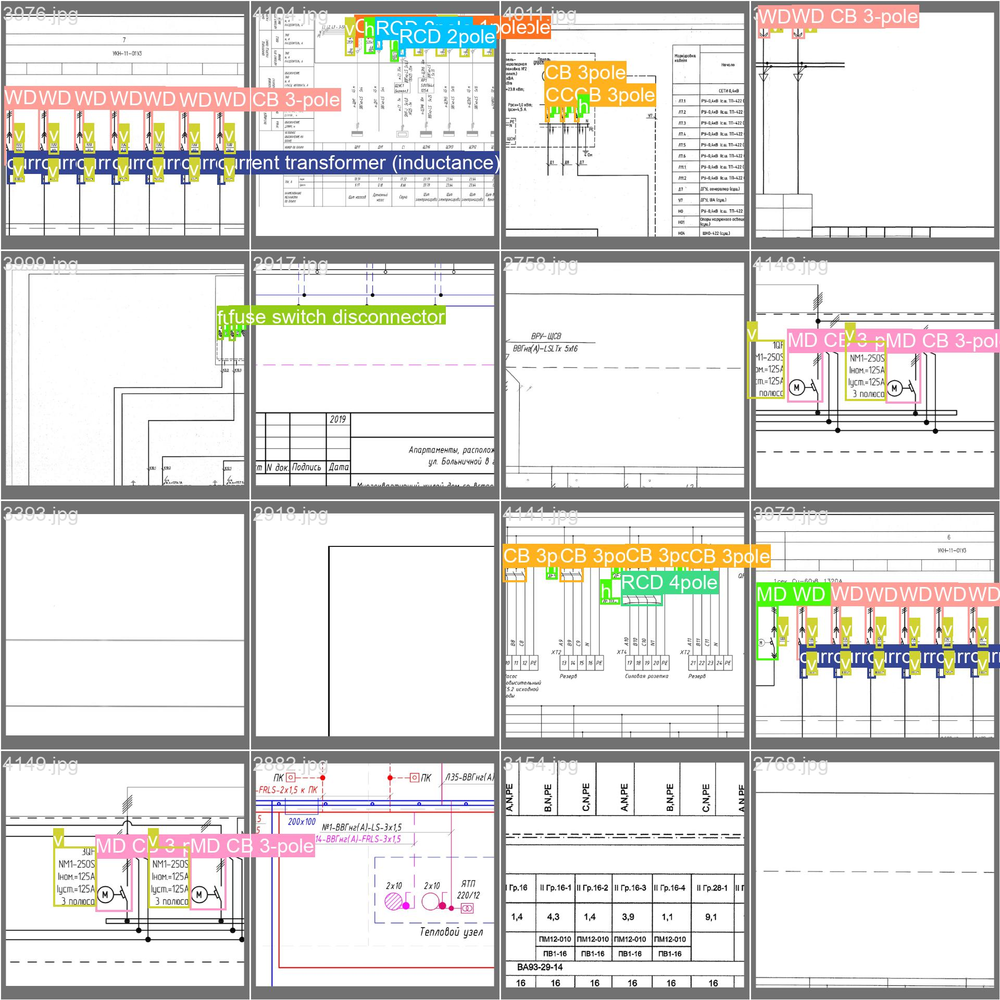 | 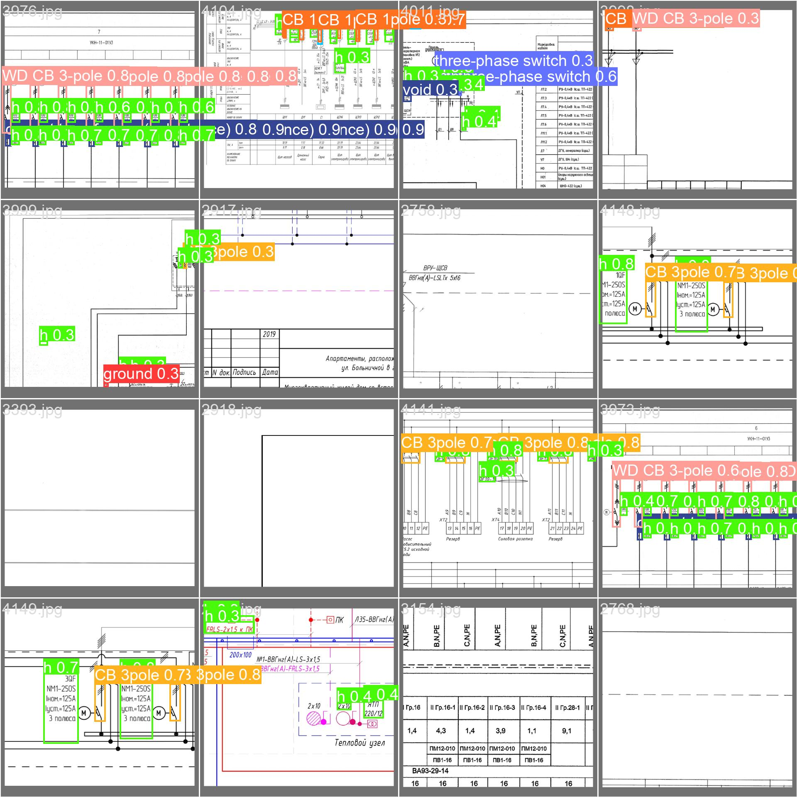 |
| 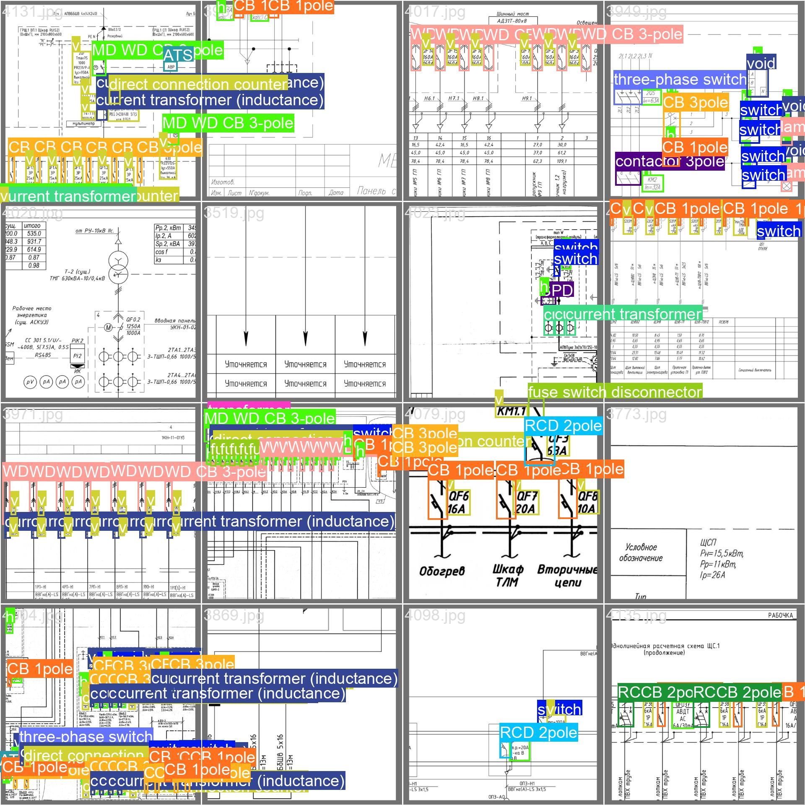 | 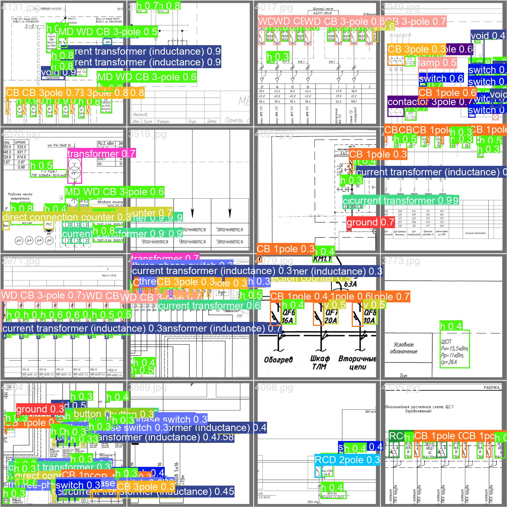 |

| results                    |                            |
| -------------------------- | -------------------------- |
| 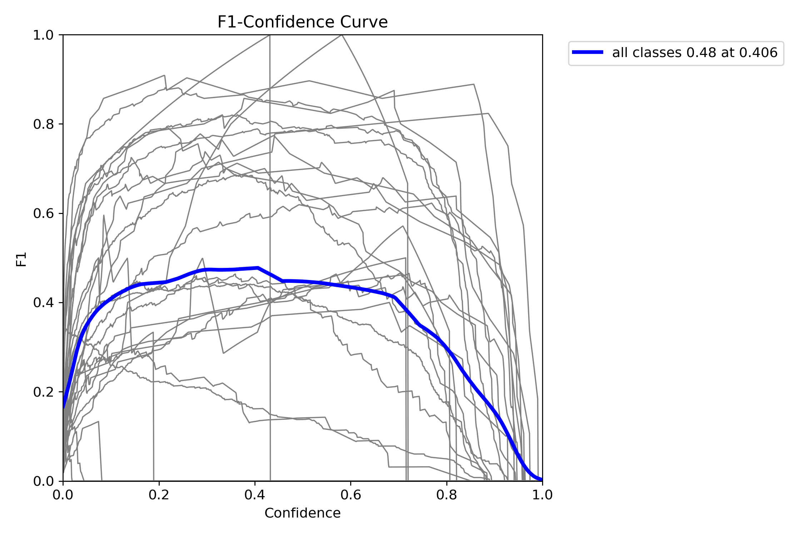 | 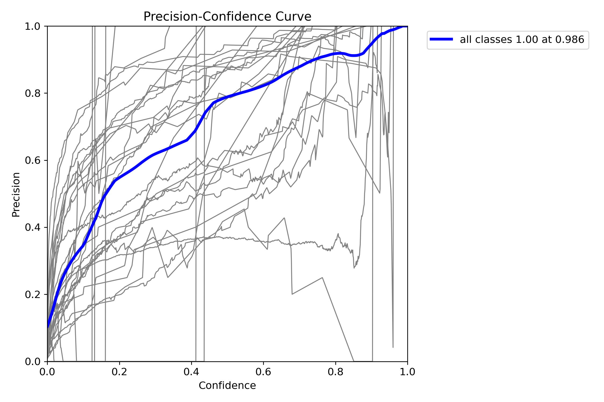  |
| 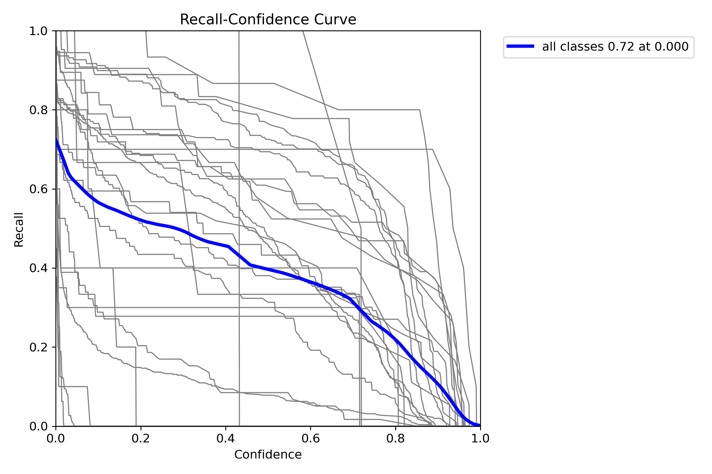  | 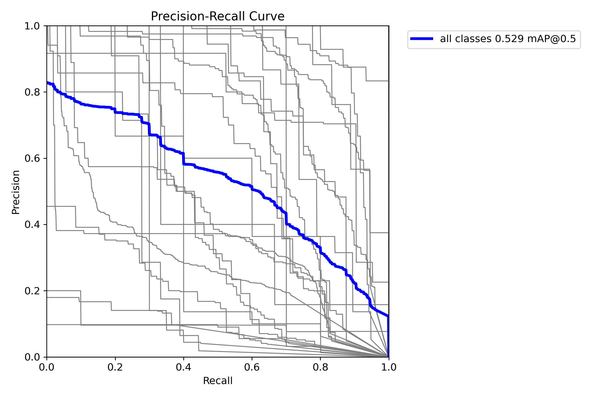 |

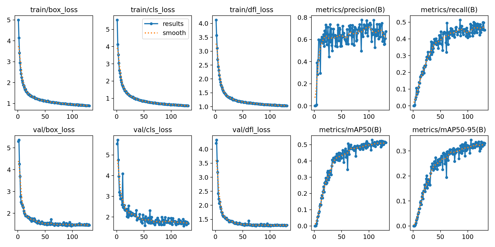

### Чернов Андрей

```python
from ultralytics import YOLO

model = YOLO('yolov8m.yaml')

# fully default hyps
# , device='cuda'
model.train(data='/misc/home1/s0202/chernov/datasets/new_stable_dataset2/data.yml',
            epochs=500, 
            patience=25, 
            batch=125, 
            device='cuda', 
            imgsz=512,
            workers=1,
            mosaic=0,
            scale=0.1)
```

<details>
    <summary>Output...</summary>

```python  

YOLOv8m summary: 295 layers, 25902640 parameters, 25902624 gradients, 79.3 GFLOPs

train: Scanning /misc/home1/s0202/chernov/datasets/new_stable_dataset2/train.cache... 3056 images, 0 backgrounds, 0 corrupt: 100%|██████████| 3056/3056 [00:00<?, ?it/s]
val: Scanning /misc/home1/s0202/chernov/datasets/new_stable_dataset2/val.cache... 765 images, 0 backgrounds, 0 corrupt: 100%|██████████| 765/765 [00:00<?, ?it/s]
optimizer: 'optimizer=auto' found, ignoring 'lr0=0.01' and 'momentum=0.937' and determining best 'optimizer', 'lr0' and 'momentum' automatically... 
optimizer: SGD(lr=0.01, momentum=0.9) with parameter groups 77 weight(decay=0.0), 84 weight(decay=0.0009765625), 83 bias(decay=0.0)
Image sizes 512 train, 512 val
Starting training for 500 epochs...

      Epoch    GPU_mem   box_loss   cls_loss   dfl_loss  Instances       Size
      1/500      33.4G      5.462      6.161      4.255        461        512: 100%|██████████| 25/25 [00:58<00:00,  2.33s/it]
                 Class     Images  Instances      Box(P          R      mAP50  mAP50-95): 100%|██████████| 4/4 [00:03<00:00,  1.21it/s]
                   all        765       6835          0          0          0          0


      Epoch    GPU_mem   box_loss   cls_loss   dfl_loss  Instances       Size
     17/500      33.5G      1.136      1.019      1.131        467        512: 100%|██████████| 25/25 [00:53<00:00,  2.16s/it]
                 Class     Images  Instances      Box(P          R      mAP50  mAP50-95): 100%|██████████| 4/4 [00:11<00:00,  2.97s/it]
                   all        765       6835      0.656      0.442      0.526      0.346

      Epoch    GPU_mem   box_loss   cls_loss   dfl_loss  Instances       Size
     75/500      32.6G     0.7447     0.4481     0.9319        550        512: 100%|██████████| 25/25 [00:36<00:00,  1.47s/it]
                 Class     Images  Instances      Box(P          R      mAP50  mAP50-95): 100%|██████████| 4/4 [00:07<00:00,  1.91s/it]
                   all        765       6835       0.72      0.598      0.679      0.478
      Epoch    GPU_mem   box_loss   cls_loss   dfl_loss  Instances       Size
     95/500      33.5G     0.6861     0.4055     0.9097        512        512: 100%|██████████| 25/25 [00:35<00:00,  1.42s/it]
                 Class     Images  Instances      Box(P          R      mAP50  mAP50-95): 100%|██████████| 4/4 [00:07<00:00,  1.90s/it]
                   all        765       6835      0.904      0.809      0.889      0.681

      Epoch    GPU_mem   box_loss   cls_loss   dfl_loss  Instances       Size
     96/500      33.5G     0.6837     0.4057     0.9101        520        512: 100%|██████████| 25/25 [00:35<00:00,  1.43s/it]
                 Class     Images  Instances      Box(P          R      mAP50  mAP50-95):   0%|    
    
    "кончилось время :("
```
</details>  

| labels                              | pred                              |
| ----------------------------------- | --------------------------------- |
| 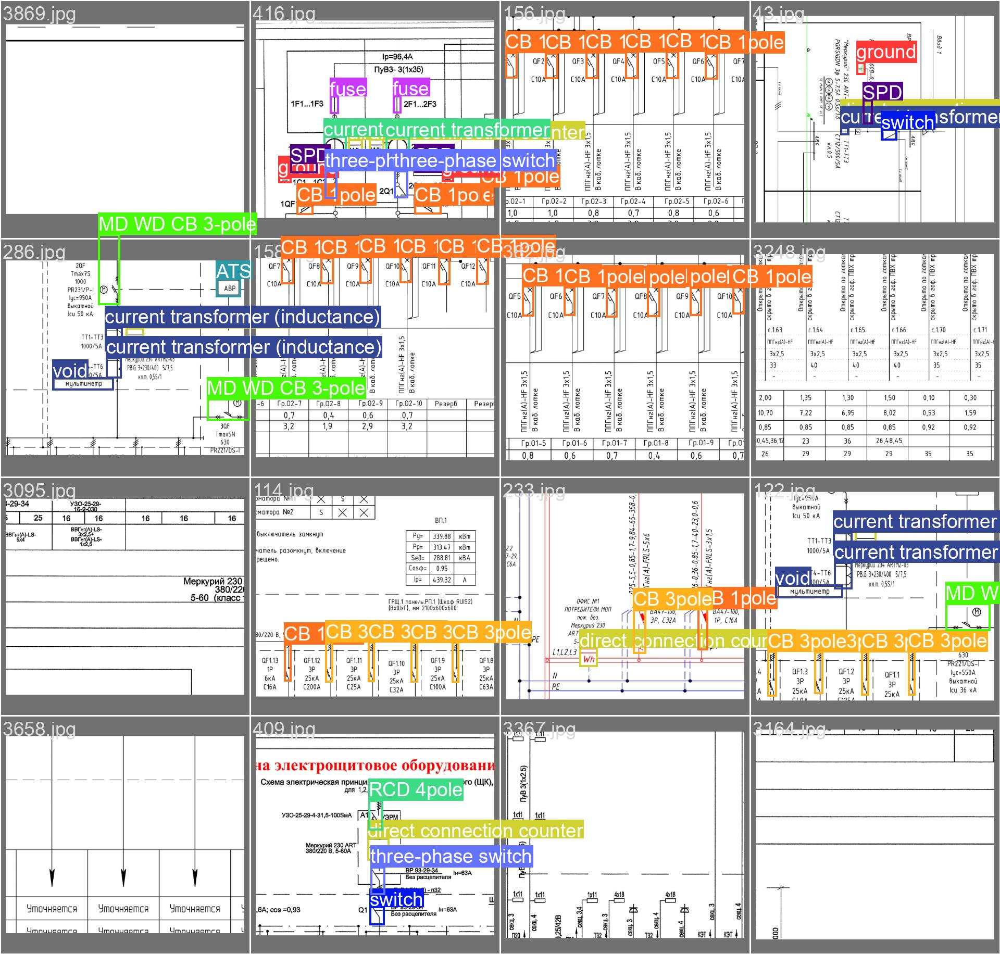 | 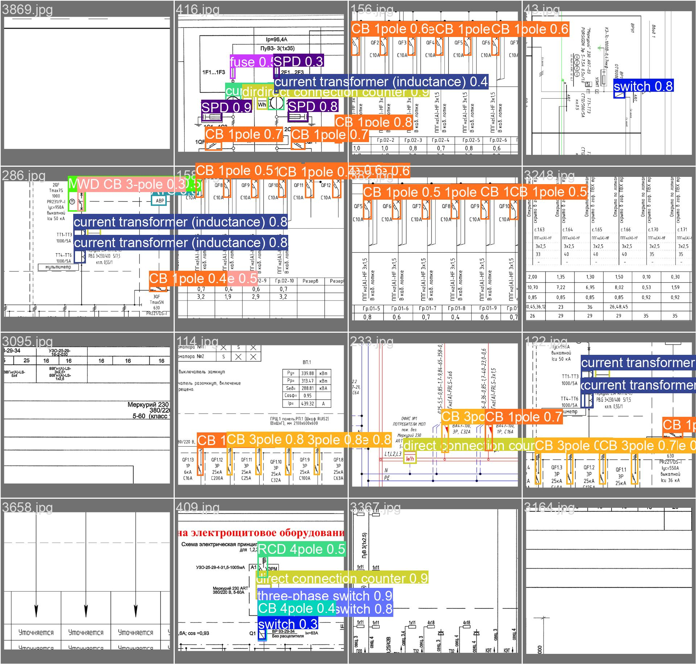 |
| 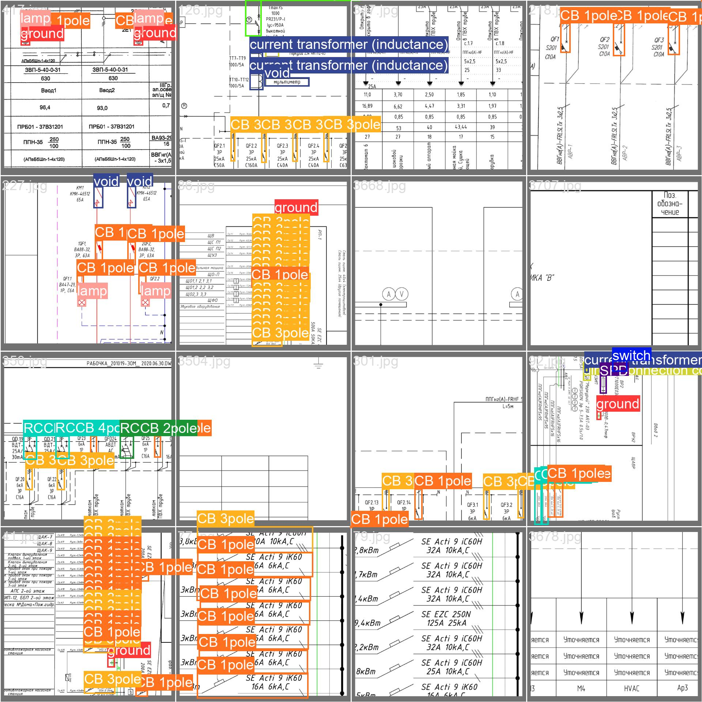 | 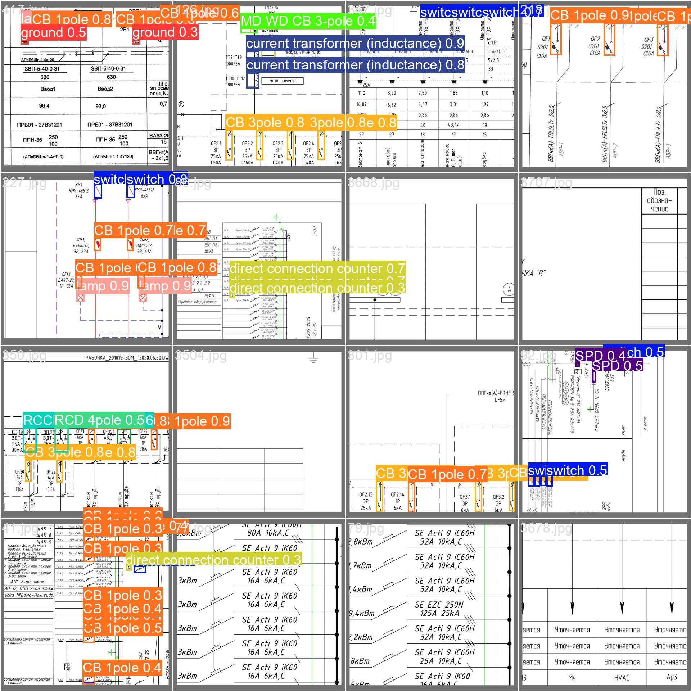 |
| 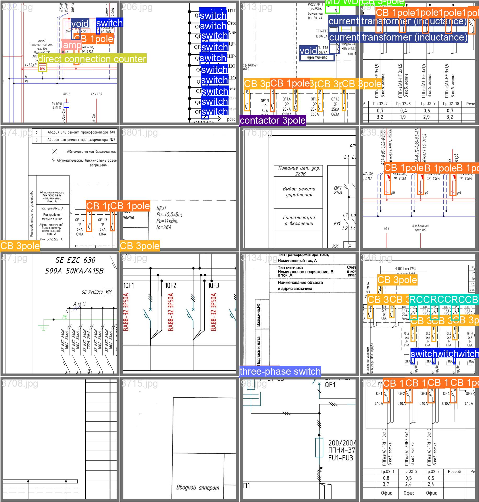 | 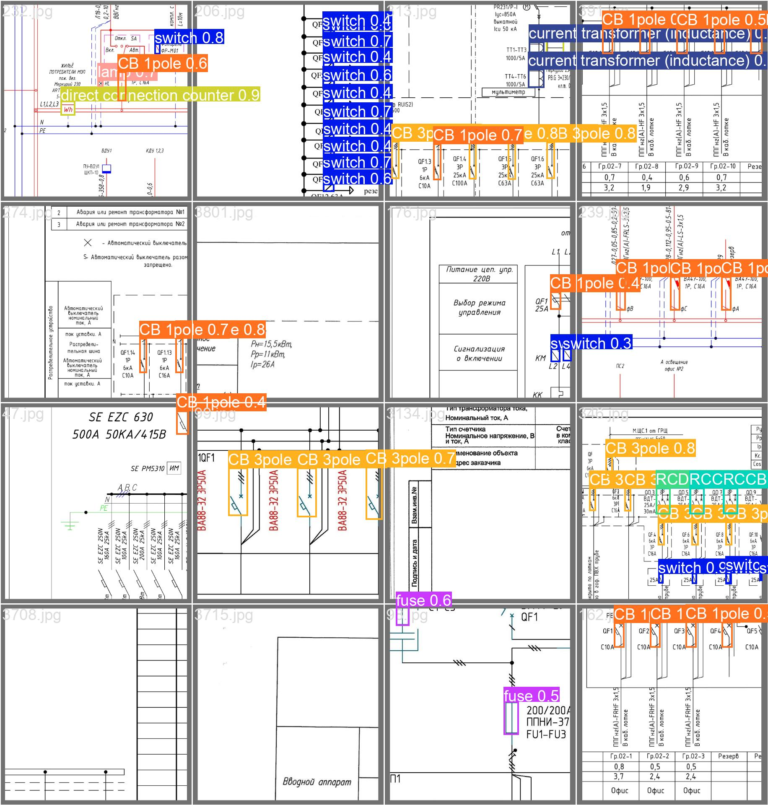 |

| results                    |                            |
| -------------------------- | -------------------------- |
| 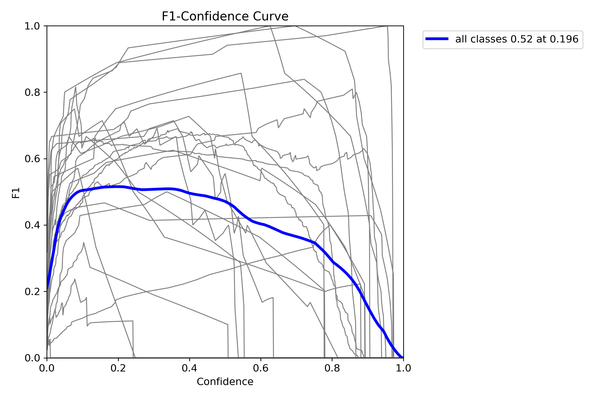 | 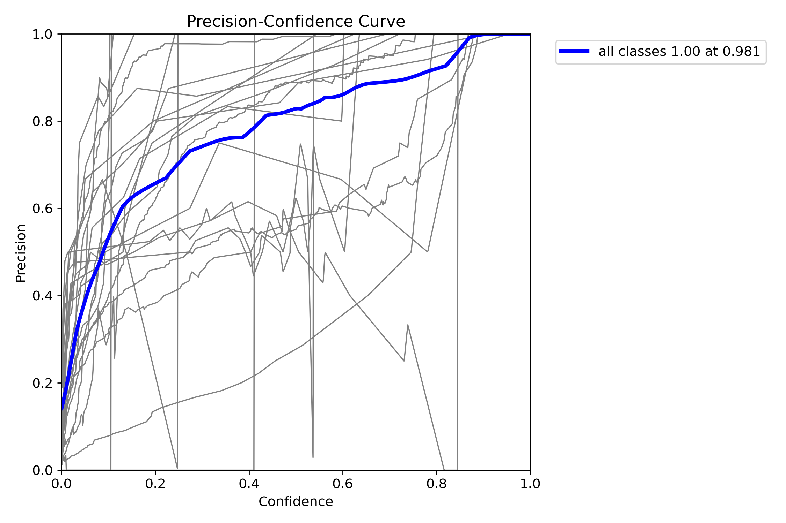  |
| 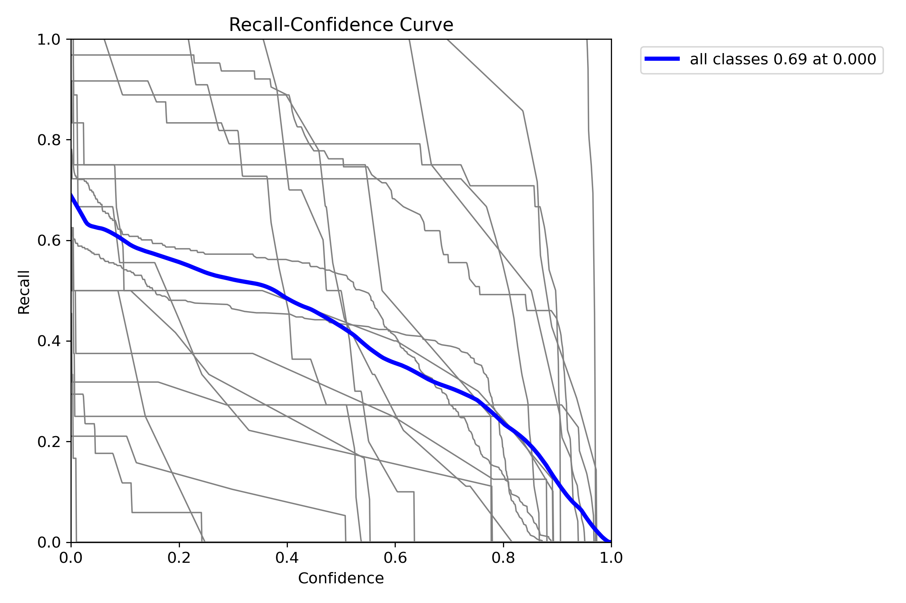  | 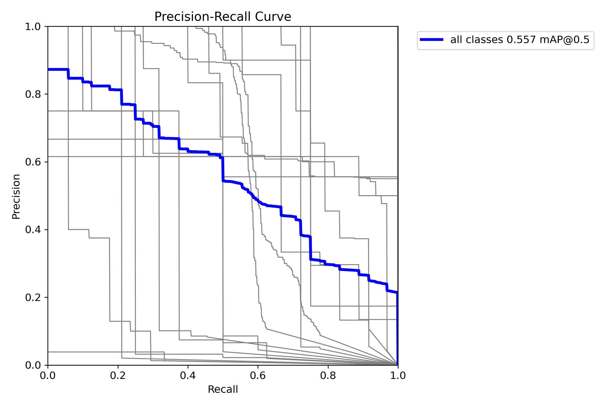 |

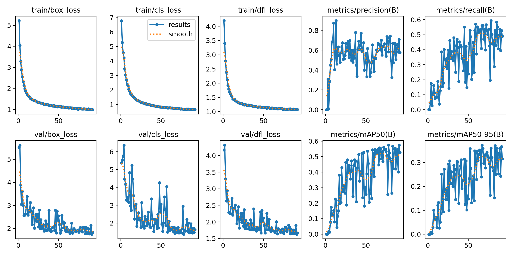